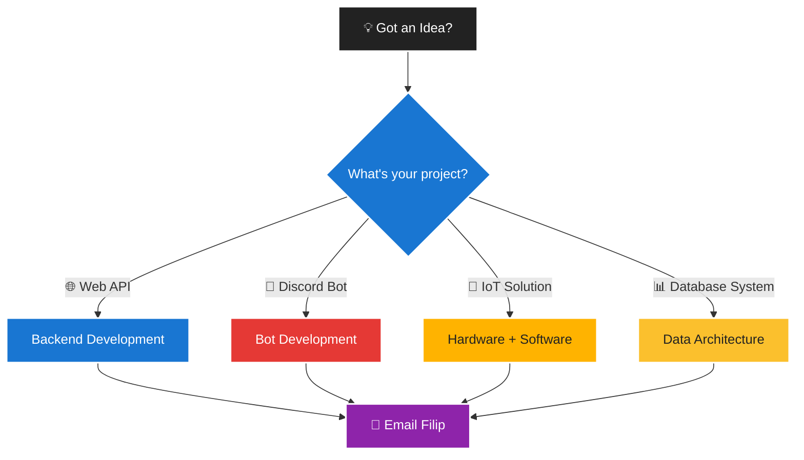
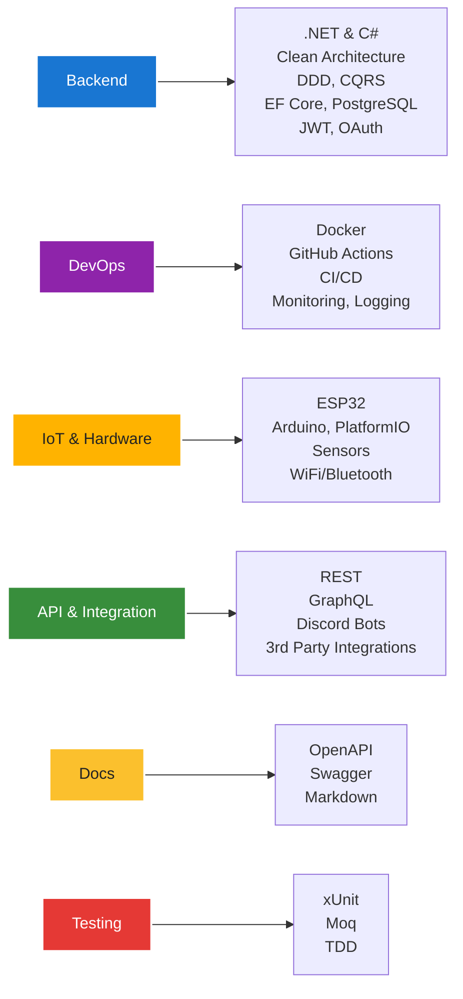

# 👋 Hi there, I'm Filip

## 🚀 Backend Developer | Software Architect | Software Craftsman

> *Building scalable, production-ready applications with modern technologies for You. Swiftly and reliably.*

---

### 📫 Let's Build Something Amazing Together!

**Ready to start your project?**
- 💬 Quick chat or email: [contact@mail.pindej.cz](mailto:contact@mail.pindej.cz)
- 📋 Project planning & tech stack advice
- ⚡ Rapid, clean, and documented development
- 🚀 Launch & ongoing support

---

### 🌟 Technologies I Love Working With

---

### 🎯 What I Bring to the Table

- **Backend Architecture:** Scalable, maintainable APIs and systems
- **API Design:** REST, GraphQL, Discord bots, integrations
- **IoT Development:** ESP32, sensors, hardware-software bridge
- **DevOps:** CI/CD, Docker, monitoring, cloud
- **Testing & Quality:** TDD, xUnit, Moq, code quality
- **Security:** JWT, OAuth, secure coding

---

*"Writing clean, maintainable code is not just about solving today's problems—it's about empowering tomorrow's solutions."*

<!--
**fpindej/fpindej** is a ✨ _special_ ✨ repository because its `README.md` (this file) appears on your GitHub profile.

Here are some ideas to get you started:

- 🔭 I’m currently working on ...
- 🌱 I’m currently learning ...
- 👯 I’m looking to collaborate on ...
- 🤔 I’m looking for help with ...
- 💬 Ask me about ...
- 📫 How to reach me: ...
- 😄 Pronouns: ...
- ⚡ Fun fact: ...
-->
