# 👋 Hi there, I'm Filip

## 🚀 Backend Developer | Software Architect | Software Craftsman

> *Building scalable, production-ready applications with modern technologies for You. Swifltky and reliably*

---

### 🌟 Technologies I Love Working With


---

### 🎯 What I Bring to the Table


- **Backend Architecture**: Scalable, maintainable server-side solutions
- **API Design**: RESTful and GraphQL APIs with comprehensive documentation
- **IoT Development**: ESP32-based solutions with cloud integration
- **DevOps Integration**: Complete CI/CD pipelines and containerization
- **Testing Excellence**: Comprehensive testing strategies for quality assurance
- **Security Focus**: Authentication, authorization, and secure coding practices
- **Performance Optimization**: Efficient queries, caching, and resource management
- **Integration Expertise**: Discord bots, third-party APIs, and hardware-software bridges

---

### 📫 Let's Build Something Amazing Together!

```mermaid
flowchart TD
    A[💡 Got an Idea?] --> B{What's your project?}
    
    B -->|🌐 Web API| C[Backend Development]
    B -->|🤖 Discord Bot| D[Bot Development]
    B -->|🔧 IoT Solution| E[Hardware + Software]
    B -->|📊 Database System| F[Data Architecture]
    
    C --> G[📅 Send me an email!]
    D --> G
    E --> G
    F --> G
    
    G --> H[🔍 Requirements Analysis]
    H --> I[📋 Technical Proposal]
    I --> J[⚡ Rapid Prototyping]
    J --> K[🚀 Full Development]
    K --> L[🎯 Deployment & Success!]
    
    style A fill:#e3f2fd
    style G fill:#f3e5f5
    style L fill:#e8f5e8
    
    click G "mailto:contact@mail.pindej.cz" "Send me an email!"
```



**Ready to start your project?**
- 💬 **Quick Chat**: Let's discuss your vision over coffee (virtual or real!)
- 📋 **Project Planning**: I'll help refine your requirements and suggest the best tech stack
- ⚡ **Rapid Development**: Clean, tested, and documented code from day one
- 🚀 **Launch & Support**: From deployment to ongoing maintenance

I'm passionate about building robust, scalable applications and always excited to discuss software architecture, best practices, and innovative solutions.

**Specializing in:**
- 🔧 Backend APIs that scale
- 🤖 Discord bots that engage communities  
- 🌐 IoT solutions that bridge physical and digital worlds
- 📊 Systems that handle real business needs

---

### 💻 Tech Stack

**Backend Development:**
- **.NET 9** | C# | ASP.NET Core Web APIs
- **Clean Architecture** & **Domain-Driven Design (DDD)**
- **Entity Framework Core** with PostgreSQL
- **JWT Authentication** & ASP.NET Core Identity
- **Repository Pattern** & **Unit of Work**
- **CQRS** & **Result Pattern** implementation

**API Development:**
- **REST APIs** with comprehensive documentation
- **GraphQL** APIs and schema design
- **Discord Bots** development and integration
- **API Versioning** & backward compatibility
- **OpenAPI/Swagger** documentation

**DevOps & Infrastructure:**
- **Docker** & **Docker Compose** multi-stage builds
- **GitHub Actions** CI/CD pipelines
- **PostgreSQL** database management
- **Serilog** structured logging
- **Health checks** & monitoring

**IoT & Hardware:**
- **ESP32** microcontroller development
- **Arduino IDE** & **PlatformIO**
- **Sensor integration** & data collection
- **WiFi/Bluetooth** communication protocols
- **Hardware-Software integration**

**Testing & Quality:**
- **xUnit** unit & integration testing
- **Moq** for mocking dependencies
- **Test-driven development (TDD)**
- **ESLint** & **Prettier** code formatting
- **Component & API testing** strategies

---

### 🏗️ Architecture & Design Principles


- **Clean Architecture** with clear separation of concerns
- **Domain-Driven Design (DDD)** with rich domain models
- **SOLID principles** implementation
- **Database migrations** with Entity Framework
- **API versioning** & comprehensive documentation
- **Error handling** with custom middleware
- **Security best practices** with JWT & refresh tokens

---

### 🔧 My Development Philosophy

Building robust, scalable applications across the full technology stack:

**Backend:**
- **.NET 9 Web API** with Clean Architecture
- **PostgreSQL** with Entity Framework Core
- **JWT Authentication** with refresh token support
- **Docker containerization** for all environments
- **Comprehensive testing** suite (API & Component tests)
- **REST API design** with comprehensive documentation

**Integration & Hardware:**
- **Multi-service architecture** coordination
- **ESP32 IoT development** with sensor integration
- **Database design** and optimization
- **Message queuing** and background services

**DevOps:**
- **GitHub Actions** for automated testing & deployment
- **Docker Hub** image registry
- **Environment-specific configurations**
- **Automated notifications** for development workflows

```mermaid
flowchart LR
    A[💡 Project Idea] --> B{What type?}
    B -->|Backend API| C[🚀 .NET]
    B -->|IoT Solution| D[🔧 ESP32 + Backend]
    B -->|Discord Bot| E[🤖 Discord.NET]
    B -->|Full System| F[🏗️ Clean Architecture]
    
    C --> G[REST/GraphQL APIs]
    D --> H[Sensor Data + Cloud]
    E --> I[Bot Commands + DB]
    F --> J[Complete Solution]
    
    G --> K[📊 Documentation]
    H --> K
    I --> K
    J --> K
    
    K --> L[🚀 Deployment Ready!]
    
    style A fill:#e1f5fe
    style L fill:#c8e6c9
    style B fill:#fff3e0
```

```mermaid
graph LR
    A[💡 Idea Born] --> B[📋 Requirements]
    B --> C[🏗️ Architecture]
    C --> D[📊 Database Design]
    D --> E[🚀 MVP Release]
    
    E --> F[🔐 Authentication]
    F --> G[📱 API Endpoints]
    G --> H[🧪 Testing Suite]
    H --> I[✨ Feature Release]
    
    I --> J[🐳 Containerization]
    J --> K[🔄 CI/CD Pipeline]
    K --> L[📈 Monitoring]
    L --> M[🎯 Production Ready]
    
    style A fill:#e3f2fd
    style E fill:#f3e5f5
    style I fill:#e8f5e8
    style M fill:#c8e6c9
```





---

### 📊 Development Practices

```csharp
public record DeveloperApproach
{
    public required ArchitectureStack Architecture { get; init; } = new()
    {
        Pattern = "Clean Architecture + DDD",
        Principles = ["SOLID", "DRY", "KISS", "YAGNI"],
        Layers = ["Domain", "Application", "Infrastructure", "Presentation"]
    };
    
    public required TestingPhilosophy Testing { get; init; } = new()
    {
        Strategy = TestStrategy.TDD,
        Frameworks = ["xUnit", "Moq"],
        Coverage = ["Unit", "Integration", "Component"],
        Practices = ["Red-Green-Refactor", "Arrange-Act-Assert"]
    };
    
    public required DeploymentStrategy Deployment { get; init; } = new()
    {
        Pipeline = "GitOps with GitHub Actions",
        Containerization = "Docker multi-stage builds",
        Orchestration = "Docker Compose",
        Environments = ["Development", "Staging", "Production"]
    };
    
    public required ApiDocumentation Documentation { get; init; } = new()
    {
        Standards = ["OpenAPI 3.0", "JSON Schema"],
        Tools = ["Scalar UI", "Swagger", "Postman Collections"],
        Practices = ["API-First Design", "Versioning Strategy"]
    };
    
    public required SecurityImplementation Security { get; init; } = new()
    {
        Authentication = "JWT with Refresh Tokens",
        Authorization = "Role-based + Claims-based",
        Practices = ["HTTPS Everywhere", "Input Validation", "OWASP Top 10"],
        Identity = "ASP.NET Core Identity"
    };
    
    public required ObservabilityStack Monitoring { get; init; } = new()
    {
        Logging = "Serilog with structured logging",
        Metrics = "ASP.NET Core built-in + custom",
        HealthChecks = "Deep health monitoring",
        Tracing = "OpenTelemetry distributed tracing"
    };
    
    public required ScalabilityPatterns Scalability { get; init; } = new()
    {
        DataAccess = "Repository + Unit of Work",
        DependencyInjection = "Built-in DI Container",
        Async = "async/await throughout",
        Caching = "In-memory + distributed caching",
        Patterns = ["CQRS", "Mediator", "Result Pattern"]
    };
}
```

---

*"Writing clean, maintainable code is not just about solving today's problems—it's about empowering tomorrow's solutions."*

<!--
**fpindej/fpindej** is a ✨ _special_ ✨ repository because its `README.md` (this file) appears on your GitHub profile.

Here are some ideas to get you started:

- 🔭 I’m currently working on ...
- 🌱 I’m currently learning ...
- 👯 I’m looking to collaborate on ...
- 🤔 I’m looking for help with ...
- 💬 Ask me about ...
- 📫 How to reach me: ...
- 😄 Pronouns: ...
- ⚡ Fun fact: ...
-->
